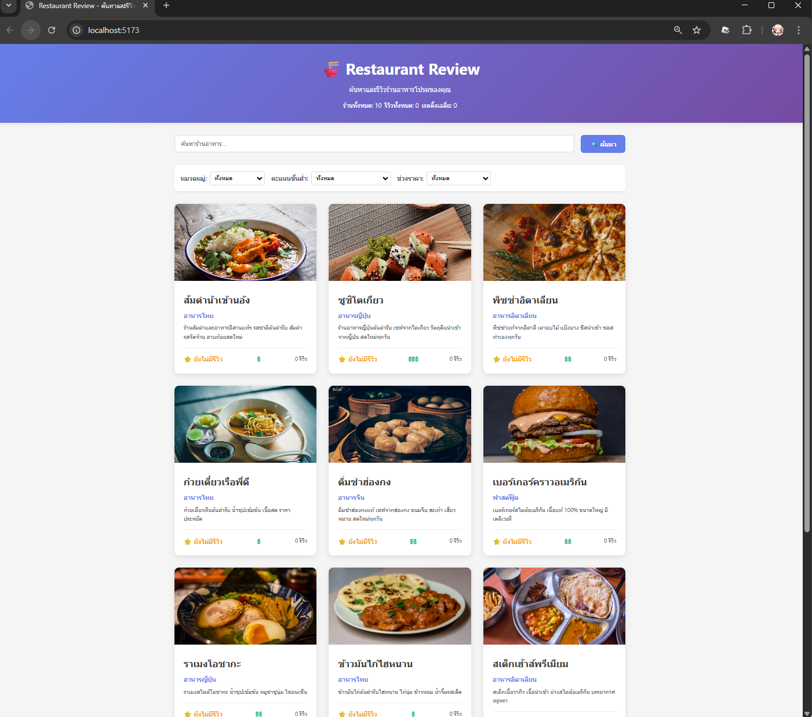
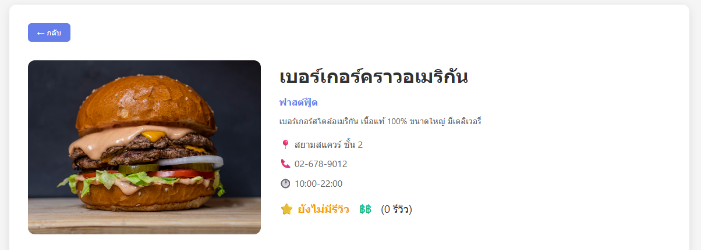
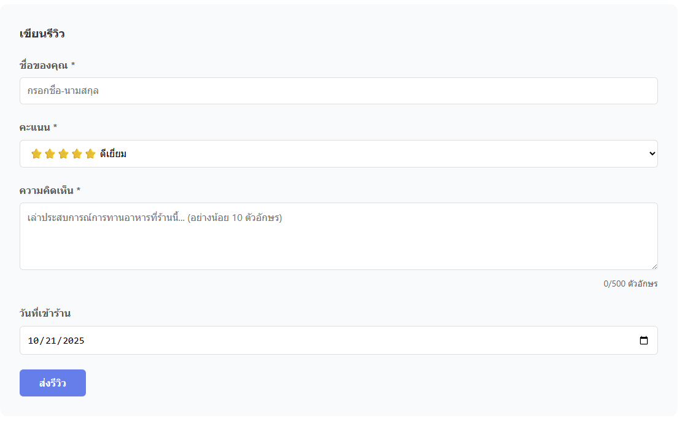
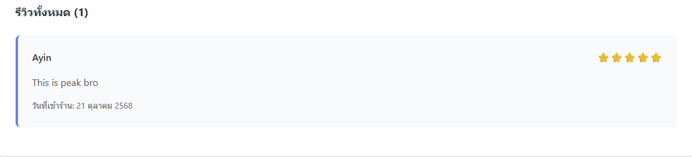

# Restaurant Review Website

## รายละเอียดโปรเจค
เว็ปไซต์รีวิวร้านอาหารที่เราไปกิน สามารถค้นหาได้หลากหลาย มีเมนูมากมายให้เลือกสรร เเละสามารถรีวิวเป็นรายการๆได้
ทั้งยังดูรีวิวโดยรวม ถือเป็นเมนูเเนะนำของร้านที่มีคะเเนนรีวิวเยอะๆ หรือสามารถอ่านความคิดเห็นจองรีวิวเเต่ละรีวิวของลูกค้าเเต่ละคนได้

## เทคโนโลยีที่ใช้
- Frontend: React 18 + Vite
- Backend: Node.js + Express
- Database: JSON File Storage

## Features ที่ทำได้
### Required Features (70 คะแนน)
- [✅] แสดงรายการร้านอาหาร
- [✅] ค้นหาร้าน
- [✅] กรองตามหมวด/rating/ราคา
- [✅] ดูรายละเอียดร้าน
- [✅] เพิ่มรีวิว
- [✅] Validation
- [✅] อัพเดท rating อัตโนมัติ

### Bonus Features (ถ้ามี)
- [ ] Sort restaurants
- [ ] Responsive design
- [ ] Animations

## วิธีติดตั้งและรัน

### Backend
```
- cd backend
- npm install
- cp .env.example .env
- npm run dev
```

### Frontend
```
- cd frontend
- npm install
- npm run dev
```

## API Endpoints
- GET `/api/restaurants` - ดึงรายการร้านทั้งหมด
- GET `/api/restaurants/:id` - ดึงร้านตาม ID
- POST `/api/reviews` - เพิ่มรีวิว
- GET `/api/stats` - ดึงสถิติ

## Screenshots
### หน้าแรก


### รายละเอียดร้าน


### ฟอร์มรีวิว




## ผู้พัฒนา
- นาย ภูริณัฐ เต๋จ๊ะ
- รหัสนักศึกษา 67543210022-9
- Email phurinut_te67@live.rmutl.ac.th

## License
MIT License
